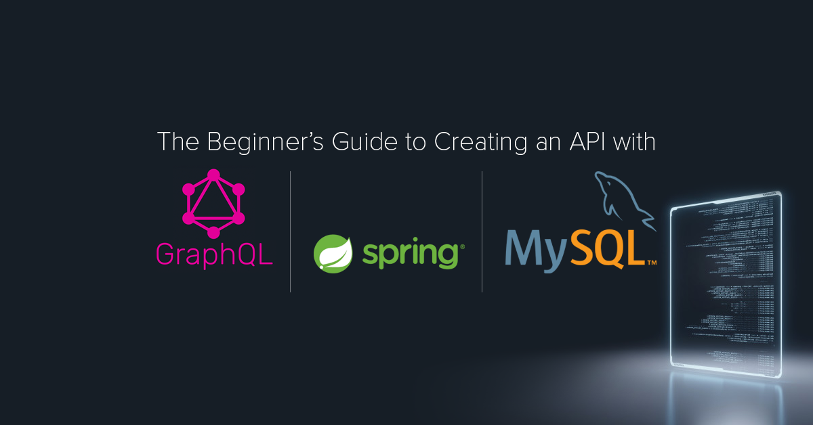

# graphql-springboot-demo 

This project demonstrates how to integrate GraphQL and build APIs with Spring-Boot.

### Prerequisites
To run the application you need:
* JDK 8 or later
* MySQL

### Run the application locally
1. Download the zip or clone the Git repository
2. Config MySQL properties from `src/main/resources/application.yml`
3. Open the terminal in the root directory and simply run the following command

       mvnw spring-boot:run

### Access the app
Take a high-level overview of the application using
[Voyager](http://localhost:8085/voyager)

Access the APIs using

Access the APIs using
[Playground](http://localhost:8085/playground)

Access the APIs using
[Altair](http://localhost:8085/altair)

  <b>Thank You :)</b>

